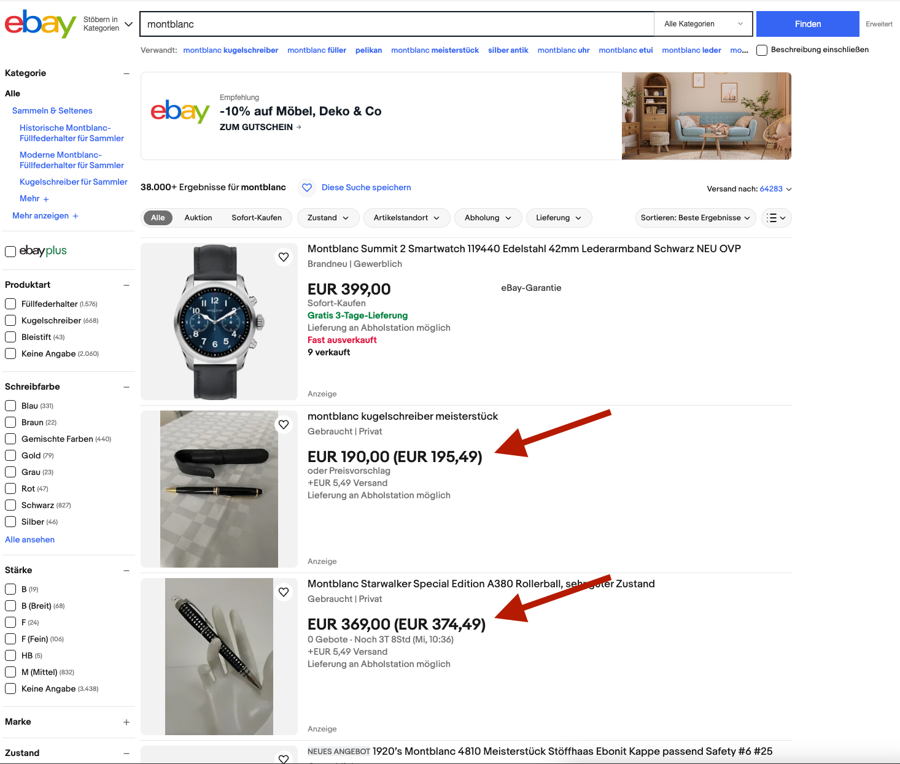

# Ebay Total Price

A Chrome/Edge extension that shows the total price of each item in the search results page of Ebay.

## Installation

1. Clone this repository.
2. Open Chrome and go to `chrome://extensions/`.
3. Enable "Developer mode".
4. Click "Load unpacked extension..." and select the directory where you cloned this repository.
5. Go to Ebay and search for something. You should see the total price of each item in the search results page.

## Example

## License

I don't care. Do whatever you want with this.
